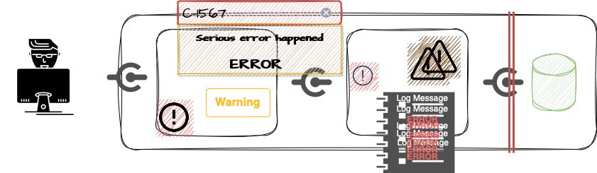

## Тодор Олев
## https://www.linkedin.com/in/todor-olev-81519825/
## todor.olev@gmail.com
<br/>
<br/>

# Валидация на ***аргументите*** при създаване на обекти в Java

## От къде идват данните?


Аз ще изпратя точно такива данни, с които приложението да работи добре и да не се "чупи". Обаче Страхил може да не знае как да подготви данните или да иска нарочно да доведе приложението до нестабилно състояние. <br/>
От гледна точка на използваемостта и на софтуерната сигурност един от защитните механизми, които можем да приложим, е ***валидация на входните данни***.

## Валидация на входните данни
Валидацията на входните данни представлява проверка, че данните пристигат в състояние, което е очаквано и отговаря на определени изисквания. Данни, които не са в очаквано състояние или не отговарят на изискванията, биват "отхвърлени" и не достигат до "вътрешността" на софтуера.

### Къде е "вътрешността" на софуера?


Ако софтуерът ни използва база от данни, то обикновено важи правилото, че невалидирани данни не би трябвало да достигат до базата. 
Aко данните достигнат нашето приложение и след това "пътуват" между различни компоненти, класове и методи, преди да достигнат базата от данни, то те отново биха могли да навредят. 
|Използваемост|Сигурност|
|-------------|---------|
|грешки, "замърсяване" на лог-съобщенията, показване на неподходящо съдържание или дори отказ или значително забавяне|XSS, directory traversal, проблеми при ъплоуд на файлове, показване на неподходящо съдържание|


Неподходящото съдържание стресира и обърква потребителите, а може и да помогне Страхил да реализира успешна атака към приложението.

### ***Изводи*** за валидацията на входните данни

Валидацията на входните данни е най-ефективна тогава, когато е приложена възможно най-рано в потока от данни на приложението.

[OWASP Input Validation Cheat Sheet](https://cheatsheetseries.owasp.org/cheatsheets/Input_Validation_Cheat_Sheet.html)

## Създаване на обекти от входни данни. Десериализация.
JSON
```json
{
    "ownerName": "Todor",
    "ownerSurname": "Olev",
    "plate": "E0050MA"
}
```

JAVA
```java
@Getter
@Setter
public class RegistrationRequest {
    private String ownerName;
    private String ownerSurname;
    private String plate;
}

```
Данните променят формата си. Страхил изпраща JSON, което е практически текст; а приложението работи с обекти от тип RegistrationRequest.<br/>

 
Процесът на преобразуване на данни от формат, удобен за пренос или съхранение до обект в Java се нарича ***десериализация***.<br/>
В приложенията с HTTP интерфейси десериализацията обикновено е едно от първите неща, които се случва с входните данни, затова е и подходящ момент за валидация.

## Имплементиране на „вградена“ валидация.
Нека да разгледаме нашето приложение, да проследим десериализацията и да видим как можем да я допълним с валидация на данните.

### Библиотеки за валидация
 - [Hibernate Validator](https://hibernate.org/validator/)
 - [Jakarta Bean Validation](https://beanvalidation.org)
 - [Apache Commons Validator](https://commons.apache.org/proper/commons-validator/)
 - [OWASP safetypes](https://owasp.org/www-project-safetypes/)

