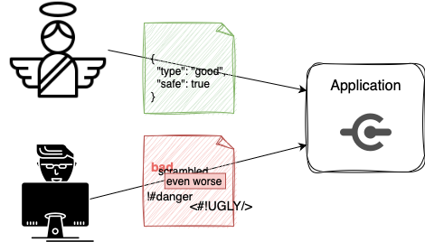
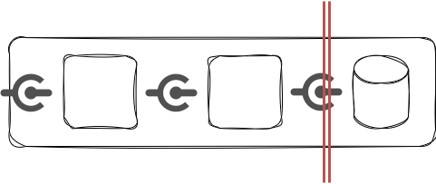
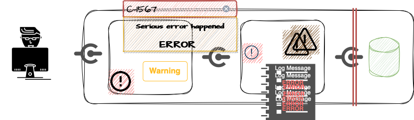
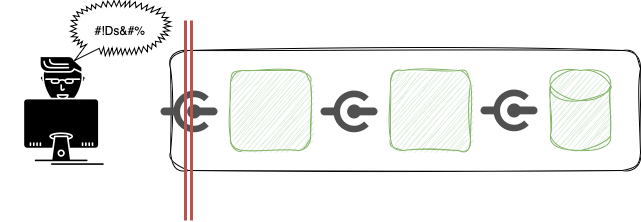
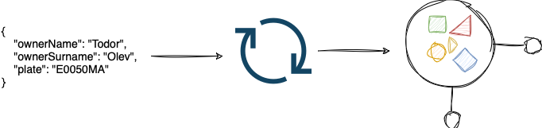

## Тодор Олев
## https://www.linkedin.com/in/todor-olev-81519825/
## todor.olev@gmail.com
<br/>
<br/>

# Валидация на аргументите[^1] при създаване на обекти в Java

## От къде идват данните?
Нека си представим, че имаме приложение, което е достъпно в Интернет и което получава данни по някакъв комуникационен канал (напр. HTTP, WebSocket, messaging service). Трудно можем да определим от къде точно идват данните - кой ги е създал и как са били променяни преди да достигнат до нашето приложение. Ако аз изпратя някакви данни към приложението, по някой от неговите комуникационни канали, то аз мога да се постарая да изпратя точно такива данни, с които приложението ще работи добре и както се очаква, няма да се "чупи" и няма да изпадне в неочаквано състояние. Нека си представим, че не аз, а Страхил ще определя какви данни ще се изпращат към приложението. Страхил може да не знае как да подготви данните и да изпрати нещо, което приложението не може да "разбере". Или Страхил може да иска нарочно да доведе приложението до неочаквано или нестабилно състояние. След като е наблюдавал поведението на приложението Страхил смята, че е разбрал как да подготви данните така, че да навреди на рботата на приложението или на данните, с които то работи. 



Страхил е източник на данни, които достигат до нашето приложение - може да е човек или друг софтуер. Не е разумно просто да приемем, че той се съобразява с начините на работа в приложението или че има добри намерения. Много по-разумно би било да защитим приложението си, както и данните, с които то работи.

От гледна точка на използваемостта и на софтуерната сигурност един от защитните механизми, които можем да приложим, е валидация на входните данни[^2].

## Валидация на входните данни
Валидацията на входните данни представлява проверка, че данните пристигат в състояние, което е очаквано и отговаря на определени изисквания. Данни, които не са в очаквано състояние или не отговарят на изискванията, биват "отхвърлени" и не достигат до "вътрешността" на софтуера.

### Къде е "вътрешността" на софуера?
По друг начин този въпрос може да звучи като *"Кога можем да вземем решение да отхвърлим данните?"*. Трудно е да се определи еднозначно къде е "пределната линия" до която ще допускаме невалидирани данни. Ако софтуерът ни използва база от данни, то обикновено важи правилото, че невалидирани данни не би трябвало да достигат до базата. Много често обаче това не е достатъчна защита. 



Нека да се върнем към примера с нашето приложение, с което се е заел Страхил. Не се притесняваме за данните, които влизат в базата от данни, защото сме изградили непробиваема защита пред нея, чрез която всички данни се валидират прецизно. Въпреки това, ако данните достигнат нашето приложение и след това "пътуват" между различни компоненти, класове и методи, преди да достигнат базата от данни, то те отново биха могли да навредят. От гледна точка на използваемостта на приложението може да наблюдаваме неочаквано поведение - например грешки, "замърсяване" на лог-съобщенията, показване на неподходящо съдържание (например кодове на грешки, неясен текст, придружен с червени Х и !) или дори отказ или значително забавяне. От гледна точка на софтуерната сигурност също има редица потенциални проблеми, например XSS, directory traversal, проблеми при ъплоуд на файлове, отново показване на неподходящо съдържание, което може да помогне Страхил да реализира успешна атака към приложението и други.



### Извод за валидацията на входните данни
 - Валидацията на входните данни е най-ефективна тогава, когато е приложена възможно най-рано в потока от данни на приложението.



### Допълнителни изводи за валидацията на входните данни
 - Данните от всички потенциално ненадеждни източници трябва да подлежат на валидиране на входа. Списъкът на потенциално ненадеждни източници включва както уеб клиенти в Интернет, така и всички канали за комуникация с партньори - всеки източник, който може да бъде компрометиран самостоятелно и да започне да изпраща неправилно формирани данни.

 - Често валидацията се имплементира чреч т.нар. block lists. Това е подход, при който определяме забранени стойности. Макар този подход да е валиден, опитът ни показва, че трябва да бъдем внимателни с него, защото често се допускат грешки: пропускане на забранени стойности; погрешно забраняване на валидни стойности (Apsotrophy shouldn't be forbidden here); създаване на лесни за "заобикаляне" списъци със забранени стойности. В повечето случаи определянето на разрешени стойности (a.k.a allow lists) е по-сигурен и подходящ метод.

 - [OWASP Input Validation Cheat Sheet](https://cheatsheetseries.owasp.org/cheatsheets/Input_Validation_Cheat_Sheet.html)

## Създаване на обекти от входни данни. Десериализация.
Когато имплементираме някаква бизнес логика, която работи върху някакви данни, в Java обикновено използваме класове, които описват тези данни. И съответно, по време на изпълнение, логиката се изпълнява върху обекти, а не върху "сурови" данни. 

Нека развием малко идеята за нашето приложение. То представлява една уеб услуга, която предлага интерфейс, достъпен чрез HTTP. Кодът, разбира се, е Java. Приложението се използва за регистрация на автомобили. За да се регистрира нов автомобил трябва да се изпрати заявка, съдържаща имената на собственика и регистрационният номер. Данните за една такава заявка се изпращат като JSON към приложението, но логиката работи върху Java обект от тип RegistrationRequest

```java
@Getter
@Setter
public class RegistrationRequest {
    private String ownerName;
    private String ownerSurname;
    private String plate;
}

```
Данните променят формата си. Страхил изпраща JSON, което е практически текст; а приложението работи с обекти от тип RegistrationRequest. Това е нормално, защото JSON е удобен "транспортен" формат, който може да участва в HTTP заявки, а типът или класът RegistrationRequest съществува само в контекста на нашето приложение, той не съществува за Страхил. Процесът на преобразуване на данни от формат, удобен за пренос или съхранение (текст, поток от байтове) до обект в Java се нарича десериализация. В приложенията с HTTP интерфейси десериализацията обикновено е едно от първите неща, които се случва с входните данни, затова е и подходящ момент за валидация. [^3]

 

## Имплементиране на „вградена“ валидация.
Нека да разгледаме нашето приложение, да проследим десериализацията и да видим как можем да я допълним с валидация на данните.

### Библиотеки за валидация
 - [Hibernate Validator](https://hibernate.org/validator/)
 - [Jakarta Bean Validation](https://beanvalidation.org)
 - [Apache Commons Validator](https://commons.apache.org/proper/commons-validator/)
 - [OWASP safetypes](https://owasp.org/www-project-safetypes/)

[^1]: в дефиницията на един метод в Java имаме име на метода, параметри и тип на резултата от изпълнението на метода. По време на самото изпълнение, на метода се подават конкретни стойности, които наричаме аргументи. Именно в този смисъл е използвана думата "аргументи" в заглавието и в този смисъл ще се разглежда и понятието "данни" по-нататък - данните са стойностите, с които работи нашата бизнес логика.

[^2]: често валидацията на входните данни се споменава заедно със санитизацията на изходните данни. Санитизацията е превръщането на данните в подходящ формат за контекста, за който са предназначени. Например, ако поставяме текст в HTML (контекстът е HTML уеб страница), то трябва да се погрижим текстът да не съдържа специалните символи от HTML (<>, /, ", ', &), за да предотвратим редица проблеми, например: текстът да не изглежда добре, да "счупим" DOM дървото, да допуснем злонамерено добавяне на javascript. Санитизацията на данни е механизъм за подобряване на използваемостта и на софтуерната сигурност, но сега ще обърнем по-специално внимание на валидацията на входните данни. 

[^3]: Процесът на преобразуване на обект в Java до формат, удобен за пренос или съхранение (текст, поток от байтове), се нарича сериализация.
