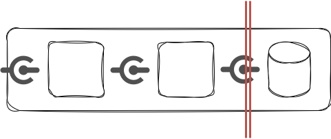
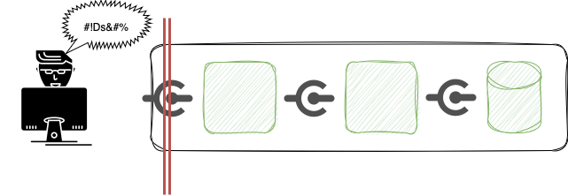
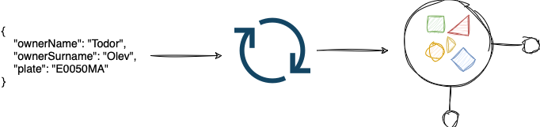

## Todor Olev
## https://www.linkedin.com/in/todor-olev-81519825/
## todor.olev@gmail.com
<br/>
<br/>

# Arguments[^1] validation on creating Java objects

## Where does the data come from?
Let's imagine that we have an application that is accessible on the Internet and that receives data over some communication channel (eg HTTP, WebSocket, messaging, etc.). It is difficult for us to determine exactly where the data came from - who created it and how it was changed before it reached our application. If I have to send some data to the application, over one of its communication channels, then I can make sure this data is well-formed, it doesn't "break" the application and it doesn't lead to unexpected conditions. Let's imagine that Dennis, not me, will determine what data will be sent to the application. Dennis may not know how to prepare the data and send something that the application can't "understand". Or Dennis may want to purposely bring the application to an unexpected or unstable state. After observing the behavior of the application, Dennis believes he has figured out how to prepare the data in such a way that it harms the operation of the application or the data it works with.


Dennis is the source of data that reaches our application - it can be a human or some software. It's not reasonable to simply assume that he conforms to the app's ways of working or that he has good intentions. It would be much wiser to protect our application as well as the data it works with.

From a usability and software security perspective, one of the security mechanisms we can implement is input validation[^2].

## Input validation
Input validation is the verification that the data arrives in a state that is expected and meets certain requirements. Data that is not in the expected state or does not meet the requirements is rejected and does not reach the "inside" of the software.

### Where is the "inside" of the software?
Alternatively, this question might sound like *"When can we decide to reject the data?"*. It's not easy to define strictly where the "border line" is, up to which we will allow unvalidated data. If our software uses a database, the rule that generally applies is that unvalidated data must not reach the database. Very often, however, this is not sufficient protection.



Let's go back to our application example that Dennis tackled. We don't worry about the data that goes into the database, because we have built a heavy defense system against it, through which all data is precisely validated. However, if the data reaches our application and then "travels" between different components, classes, and methods before reaching the database, then it could again do harm. From the usability point, we may observe unexpected behavior - errors, "pollution" of the log messages, disclosure of inappropriate content (for example, error codes, unclear text accompanied by red crosses and exclamation marks) or even failure or significant delay. From a security perspective, there are also a number of potential issues, like XSS, directory traversal, file upload issues, and again disclosure of inappropriate content that can help Dennis implement a successful attack, and more.


### Input validation outcome
  - Input validation is most effective when implemented as early as possible in the application's data flow.



### Additional outcomes for input validation
  - Data from all potentially untrusted sources must be subject to input validation. The list of potentially untrusted sources includes both web clients on the Internet and all communication channels with peers - any source that can be compromised on its own and start sending malformed data.

  - Often the validation is implemented through the so-called block lists. This is an approach where we explicitly declare the forbidden values. Although this approach is valid, our experience shows that we have to be careful with it, because mistakes are often made: omitting forbidden values; wrongly banning valid values (Apsotrophy shouldn't be forbidden here); creating easy to "bypass" lists of forbidden values. In most cases, specifying allowed values (a.k.a allow lists) is a safer and more appropriate method.

  - [OWASP Input Validation Cheat Sheet](https://cheatsheetseries.owasp.org/cheatsheets/Input_Validation_Cheat_Sheet.html)

## Create objects from input data. Deserialization.
When we implement some business logic that operates on some data, in Java we usually use classes that describe that data. And accordingly, at runtime, the logic is executed on objects, not on "raw" data.

Let's develop the idea for our application a bit further. It is a web service that offers an interface accessible via HTTP. The code is, of course, Java. The application is used to register cars. In order to register a new car, a request containing the owner's name and registration plate must be submitted. The data for such a request is sent as JSON to the application, but the logic works on a Java object of type RegistrationRequest
```java
@Getter
@Setter
public class RegistrationRequest {
    private String ownerName;
    private String ownerSurname;
    private String plate;
}

```
Data changes shape. Dennis sends JSON, which is text; and the application works with objects of type RegistrationRequest. This is normal because JSON is a convenient "transport" format that fits well in HTTP requests, and the RegistrationRequest type or class exists only in the context of our application; it does not exist for Dennis. The process of converting data from a format convenient for transport or storage (text, stream of bytes) to a Java object is called deserialization. In applications with HTTP API, deserialization is usually one of the first things that happens to input data, so it turns out to be a good time for validation. [^3]

  

## Implement "inline" validation.
Let's take a look at our application, trace the deserialization and see how we can supplement it with data validation.

### Validation libraries 
 - [Hibernate Validator](https://hibernate.org/validator/)
 - [Jakarta Bean Validation](https://beanvalidation.org)
 - [Apache Commons Validator](https://commons.apache.org/proper/commons-validator/)
 - [OWASP safetypes](https://owasp.org/www-project-safetypes/)

[^1]: in the method signature in Java, we have the method name and the number, type, and order of its parameters. During the execution itself, specific values are passed to the method parameters, which we call arguments. Here "arguments" in used in this sense exactly, and in this sense the concept of "data" will be considered further on - the values with which our business logic works are data.

[^2]: input validation is often mentioned along with output sanitization. Sanitization is the transformation of data into an appropriate format for the context for which it is intended. For example, if we put text in HTML (the context is an HTML web page), we must make sure  the text does not contain the special HTML characters (<>, /, ", ', &) in order to prevent a number of problems, for example: text not looking good, breaking the DOM tree, allowing malicious javascript to be added. Sanitization typically involves changing the data to make it context-appropriate, while preserving the semantics. Data sanitization is a mechanism for improving both usability and security, but we will focus on input validation now.

[^3]: The process of converting a Java object to a format convenient for transport or storage (text, stream of bytes) is called serialization.